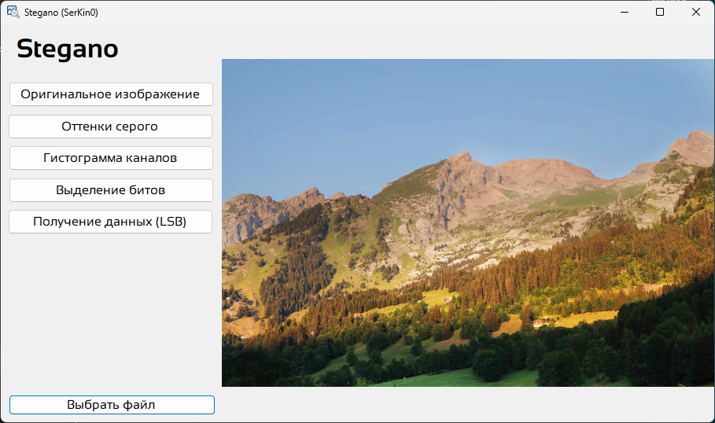

# Лабораторная работа "Стеганография"

## Постановка задачи

Дано изображение из репозитория https://github.com/RFUNN/Stego. Номер варианта рассчитывается как номер студента в списке группы +1000.

**Необходимо:**

- Преобразовать изображение из RGB в оттенки серого. Записать результат в файл.
- Выделить из полноцветного изображения любой из каналов R, G, B и построить его гистограмму.
- Используя метод LSB выяснить есть ли в изображении встроенная информация.

## Реализация

Лабораторная работа представлена в двух форматах: C# и Python.

